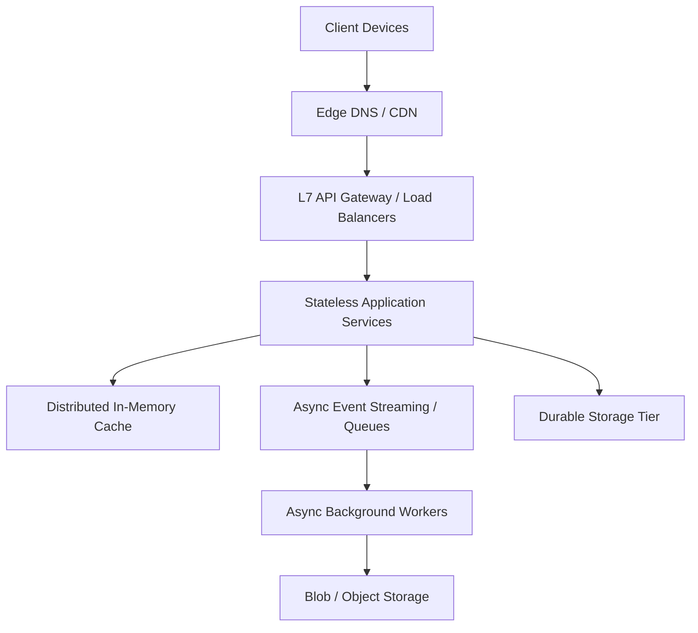

<div align="center">
  <h1>🏗️ System Architect</h1>
  <p><strong>Enterprise Distributed Systems & Architectural Skill Engine</strong></p>

  [](https://github.com/kallolchakraborty)
  [](LICENSE)
  []()
  []()
  []()
</div>

---

> The **System Architect** framework is an enterprise-grade distributed systems design engine engineered for Large Language Models (LLMs), Principal Software Architects, and Autonomous AI Coding Agents. It provides a standardized, mathematically rigorous methodology for designing scalable, fault-tolerant, high-throughput software architectures—from high-level cloud topologies down to low-level object-oriented design patterns, database sharding strategies, API contracts, and data pipelines.

---

## 📑 Table of Contents

- [🌟 Why System Architect?](#-why-system-architect)
- [🎯 Target Audience \& Use Cases](#-target-audience--use-cases)
- [🚀 Quickstart \& Installation](#-quickstart--installation)
- [🧠 The 4-Step Production Methodology](#-the-4-step-production-methodology)
- [🛡️ Behavioral \& Quality Guardrails](#️-behavioral--quality-guardrails)
- [📚 Knowledge Base Reference Modules](#-knowledge-base-reference-modules)
- [🧩 Advanced Distributed Design Patterns](#-advanced-distributed-design-patterns)
- [📊 Evaluation Engine \& Benchmark](#-evaluation-engine--benchmark)
- [🤖 Agent Prompt Blueprints](#-agent-prompt-blueprints)
- [🤝 Contribution \& License](#-contribution--license)

---

## 🌟 Why System Architect?

Designing resilient distributed systems at scale requires disciplined trade-off analysis. Generic AI coding agents often provide superficial advice like "use a cache" or "scale horizontally." **System Architect** eliminates this by enforcing rigorous engineering gates.

* **Trade-off Primacy**: Every design decision explicitly defines what is gained and what is sacrificed.
* **Mathematical Foundation**: Database engine selection, cache sizing, and queue topology are preceded by quantitative capacity calculations (RPS, Storage, Bandwidth).
* **Zero SPOF**: Every layer must feature Active-Active or Active-Passive failover topologies.
* **Resilience Engineering**: Mandatory inclusion of circuit breakers, rate limiters, retries with exponential backoff, and queue back-pressure.
* **Guaranteed Quality**: Achieved a **300/300 (100%)** score against a 60-assertion evaluation harness modeling Stanford HELM, RAGAS, and LangChain standards.

---

## 🎯 Target Audience & Use Cases

* **Autonomous AI Agents:** Empower your AI coding agents with a structured methodology to *plan before they build*.
* **Principal Architects:** Accelerate the drafting of High-Level Designs (HLDs) and comprehensive trade-off matrices.
* **Engineering Managers:** Standardize architectural review boards across teams with a unified framework.
* **System Design Candidates:** Practice interview scenarios with the most rigorous, industry-grade methodology available.

---

## 🚀 Quickstart & Installation

The skill is fully compatible with major AI agent platforms including **Google Gemini, Google Antigravity SDK, Hermes Agent Framework, OpenCode,** and popular IDEs like **Cursor and Windsurf**.

### Global Agent Installation
To install the skill globally across all agent workflows on your host environment:

```bash
# Gemini / Antigravity Agent Environments
mkdir -p ~/.gemini/config/skills
ln -s "/path/to/System Design Skill" ~/.gemini/config/skills/system-architect

# Hermes Agent Environments
mkdir -p ~/.hermes/skills/software-development
ln -s "/path/to/System Design Skill" ~/.hermes/skills/software-development/system-architect
```

### Project-Local Integration
To embed the skill engine directly into a specific Git project repository:

```bash
mkdir -p .agents/skills/system-architect
cp -r "/path/to/System Design Skill/"* .agents/skills/system-architect/
```

---

## 🧠 The 4-Step Production Methodology



### Step 1: Requirements Formulation & SLA Boundaries
Establish concrete functional scope and non-functional targets:
* **Scale Targets:** DAU, average RPS, and peak RPS.
* **Latency SLA:** p50 and p99 targets (e.g., `< 200ms`).
* **Availability Target:** 99.9% up to 99.999%.
* **Consistency Model:** Strong vs. Eventual vs. Read-your-writes.

### Step 2: Capacity Estimation & Mathematical Modeling
Execute back-of-the-envelope estimations before drafting component topologies:
* **Writes/sec** = `(Monthly Writes) / 2,500,000`
* **Reads/sec** = `(Monthly Reads) / 2,500,000`
* **3-Year Storage** = `(Record Size) * (Monthly Writes) * 36`
* **Cache RAM** = `0.20 * (Daily Active Dataset Size)`

### Step 3: High-Level Topology Design
Construct a structured component diagram traversing client-to-storage layers, justifying every component's existence based on the SLA.

### Step 4: Core Component Deep Dives
Dive into critical bottlenecks. Define SQL vs NoSQL choices via CAP theorem, cache invalidation policies, queue back-pressure limits, and produce a complete **Trade-off Summary Matrix**.

---

## 🛡️ Behavioral & Quality Guardrails

Agents utilizing this skill are subject to **strict enforcement guardrails**. 

* 🚫 **No Brand-Name Dropping:** Cannot recommend technologies without matching them to specific access patterns and scale targets.
* 🚫 **No Vague Caching:** "Use a cache" is prohibited. Must specify strategy, eviction policy, TTL, and invalidation owner.
* 🚫 **No Unaddressed SPOFs:** Single points of failure must be identified and paired with a concrete failover path.
* 🚫 **No Missing Mathematics:** Deep dives cannot proceed without quantitative capacity calculations.
* ✅ **Internal Audits:** Agents automatically run a 10-point self-audit before finalizing output to ensure compliance with the methodology.

---

## 📚 Knowledge Base Reference Modules

The system delegates technical specialization to 7 modular reference documents:

| Reference Module | Core Technical Subject | Key Contents |
| :--- | :--- | :--- |
| [`core-components.md`](references/core-components.md) | **Infrastructure & DB Scaling** | Replication, sharding, CRDTs, service mesh, observability. |
| [`capacity-cheatsheet.md`](references/capacity-cheatsheet.md) | **Capacity & Latency** | Hardware latency tables, power-of-two math, throughput formulas. |
| [`worked-examples.md`](references/worked-examples.md) | **Canonical Systems** | 8 end-to-end architectures (Twitter, Bit.ly, Ride-Sharing). |
| [`object-oriented-design.md`](references/object-oriented-design.md) | **LLD & OOP Patterns** | SOLID principles, Thread-Safe LRU Cache, Parking Lot System. |
| [`api-design-and-protocols.md`](references/api-design-and-protocols.md) | **API & Gateway Design** | REST/gRPC/GraphQL, Idempotency, Cursor Pagination, BFF. |
| [`data-engineering-and-modern-arch.md`](references/data-engineering-and-modern-arch.md) | **Data Engineering** | Batch vs Stream, CDC (Debezium), Data Lakes, Serverless. |
| [`sap-architecture-guidelines.md`](references/sap-architecture-guidelines.md) | **SAP BTP & Clean Core** | SAP CAP/RAP, Event Mesh, ISA-M, Multi-cloud integration. |

---

## 🧩 Advanced Distributed Design Patterns

* **Fan-out on Write vs. Read:** Push models ($O(1)$ reads) vs. Pull models (Fast writes), and Hybrid implementations for celebrity accounts.
* **CQRS (Command Query Responsibility Segregation):** Separating transactional writes from denormalized, asynchronous reads (e.g., Elasticsearch).
* **Circuit Breaker:** Monitoring downstream failures and failing fast (Open state) to prevent cascading system outages.
* **Saga Pattern:** Distributed transactions executed as a sequence of local events with compensating actions on failure, avoiding blocking Two-Phase Commits (2PC).

---

## 📊 Evaluation Engine & Benchmark

The repository includes a v2.0 Industry-Grade Evaluation Harness (`scripts/run_evals.py`) modeling standards from Stanford HELM, RAGAS, LangChain, and ISO/IEC 25010.

```bash
# Execute full 10-suite evaluation harness
python3 scripts/run_evals.py
```

| Suite | Category | Benchmark Standard | Tested Metric | Score |
| :--- | :--- | :--- | :--- | :--- |
| **1-4** | Execution & Coverage | Agentic Spec / RAGAS | Frontmatter, completeness, 15/15 domains | ✅ 160/160 |
| **5-7** | Quality & Safety | ISO/IEC / OWASP | Low vagueness, valid AST, safe execution | ✅ 75/75 |
| **8-10** | Readability & Budget | HELM / UX | Zero redundancy, high density, budget compliance | ✅ 65/65 |
| **TOTAL** | **Overall Quality** | **Production Standard** | **All 60 test assertions passed** | **🏆 300/300** |

---

## 🤖 Agent Prompt Blueprints

### Blueprint 1: High-Scale Architecture
> "Act as a Principal System Architect. Design a real-time Collaborative Document Editing Platform (like Google Docs) supporting 10M DAU and 100k concurrent active documents. Follow the 4-Step System Design process. Execute full capacity math, define WebSocket sync, operational transformation / CRDTs, storage layers, and provide a full trade-off matrix."

### Blueprint 2: Refactoring & Bottleneck Audit
> "Review our current architecture: Single PostgreSQL primary database with 3 replicas, Node.js monolith, and Redis cache. We are experiencing query latency spikes during flash sales (50k writes/sec). Perform a bottleneck analysis and design a migration path to a sharded / event-driven architecture using the Strangler Fig pattern."

---

## 🤝 Contribution & License

### License
This project is licensed under the terms of the **MIT License**. See [LICENSE](LICENSE) for details.

### Contribution Governance
1. **Format Compliance**: All reference documents added to `references/` must strictly adhere to the technical depth and formatting standards of the repository.
2. **Quality Gate Requirement**: Any modifications to `SKILL.md` or reference files must achieve a **100% score (300/300 pts)** on `python3 scripts/run_evals.py`.
3. **Budget Guardrails**: `SKILL.md` frontmatter description must remain $\le 1024$ characters, with trigger phrases front-loaded in the first 57 characters.
