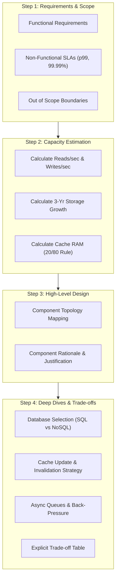

# 📖 The Master System Design Bible — Industry-Grade Distributed Architecture Framework

[](LICENSE)
[]()
[]()
[]()

> **The Definitive Blueprint for Distributed Systems Architecture.**  
> Designed as an exhaustive, production-grade reference framework for Large Language Models (LLMs), Principal Software Architects, and AI Coding Agents. This repository encodes end-to-end distributed system design—from high-throughput back-of-the-envelope capacity calculations to low-level object-oriented patterns, database sharding strategies, API idempotency specs, and cloud-native compute choices.

---

## 📑 Master Table of Contents

1. [Executive Overview & Core Axioms](#1-executive-overview--core-axioms)
2. [Repository Taxonomy & Directory Structure](#2-repository-taxonomy--directory-structure)
3. [The 4-Step Architectural Methodology](#3-the-4-step-architectural-methodology)
   - [Step 1: Requirements & Scope Formulation](#step-1-requirements--scope-formulation)
   - [Step 2: Capacity Estimation & Back-of-the-Envelope Math](#step-2-capacity-estimation--back-of-the-envelope-math)
   - [Step 3: High-Level Topology & Layering](#step-3-high-level-topology--layering)
   - [Step 4: Component Deep-Dives & Trade-Off Reasoning](#step-4-component-deep-dives--trade-off-reasoning)
4. [Master Knowledge Modules (Reference Breakdown)](#4-master-knowledge-modules-reference-breakdown)
   - [Module 1: Distributed Infrastructure & Database Scaling](#module-1-distributed-infrastructure--database-scaling)
   - [Module 2: Latency Numbers & Capacity Calculation Cheat Sheet](#module-2-latency-numbers--capacity-calculation-cheat-sheet)
   - [Module 3: Canonical Worked System Designs](#module-3-canonical-worked-system-designs)
   - [Module 4: Low-Level Design (LLD) & Object-Oriented Patterns](#module-4-low-level-design-lld--object-oriented-patterns)
   - [Module 5: API Design, Protocols & Gateway Architectures](#module-5-api-design-protocols--gateway-architectures)
   - [Module 6: Data Engineering, CDC & Cloud-Native Compute](#module-6-data-engineering-cdc--cloud-native-compute)
5. [Advanced Distributed Design Patterns](#5-advanced-distributed-design-patterns)
6. [The 12-Point Production Quality Gate Checklist](#6-the-12-point-production-quality-gate-checklist)
7. [Installation, CI/CD & Agent Integration Manual](#7-installation-cicd--agent-integration-manual)
   - [Global Agent Installation](#global-agent-installation)
   - [Workspace Integration](#workspace-integration)
   - [Automated Skill Validation](#automated-skill-validation)
   - [Prompt Blueprints for LLMs](#prompt-blueprints-for-llms)
8. [License & Contribution Standards](#8-license--contribution-standards)

---

## 1. 🚀 Executive Overview & Core Axioms

Building high-availability, high-throughput software systems requires a relentless focus on trade-offs. No single technology choice is universally correct; every decision sacrifices one system property to gain another.

### The Core Axioms of System Design
1. **Everything is a Trade-off**: You cannot optimize for read latency, write throughput, strong consistency, zero data loss, and minimal cost simultaneously. State what you gain and what you sacrifice.
2. **Math Before Architecture**: Never select database technologies, caching tiers, or queue topology without first calculating expected Reads/sec, Writes/sec, 3-year Storage growth, and Network I/O.
3. **Eliminate Single Points of Failure (SPOFs)**: Every component—from DNS to edge balancers to primary databases—must have a redundancy or failover mechanism defined.
4. **Design for Failure (Resilience)**: Assume networks partition, SSDs corrupt, CPU spikes occur, and third-party APIs fail. Embed circuit breakers, rate limiters, retries with exponential backoff, and back-pressure.
5. **Decouple Storage from Compute**: Keep application tiers stateless so they can scale horizontally behind load balancers, while pushing state down into dedicated, durable data layers.

---

## 2. 📂 Repository Taxonomy & Directory Structure

```text
System Design Skill/
├── .github/
│   └── workflows/
│       └── validate.yml                 # CI/CD automated skill validation workflow
├── scripts/
│   └── validate_skill.py                # Python validation script (frontmatter & reference links)
├── references/                          # Modular Knowledge Base (Progressive Disclosure)
│   ├── capacity-cheatsheet.md           # Latency table, power-of-two reference, throughput formulas
│   ├── core-components.md               # DB replication, sharding, CRDTs, DNS, Service Mesh, Observability
│   ├── worked-examples.md              # 8 complete end-to-end architectures (Twitter, Bit.ly, etc.)
│   ├── object-oriented-design.md        # LLD code implementations (LRU Cache, Parking Lot, Hash Map)
│   ├── api-design-and-protocols.md      # REST vs gRPC vs GraphQL, Idempotency, Cursor Pagination
│   └── data-engineering-and-modern-arch.md # Batch vs Stream, CDC (Debezium), Data Lakes, Serverless vs K8s
├── .gitignore                           # Git ignore rules for system & IDE files
├── LICENSE                              # Open-source MIT License
├── README.md                            # The Master System Design Bible (This File)
└── SKILL.md                             # Primary LLM Agent Skill & Execution Instruction Spec
```

---

## 3. 📐 The 4-Step Architectural Methodology

Every design problem executed under this framework follows a mandatory 4-step process:



### Step 1: Requirements & Scope Formulation
- **Functional Requirements**: Enumerate core user interactions (e.g., "User posts tweet", "User fetches home timeline").
- **Non-Functional Requirements**: State quantitative SLAs explicitly:
  - **Read/Write Ratio**: e.g., 100:1 (read-heavy) vs 1:1.
  - **Throughput Scale**: Daily Active Users (DAU), average RPS, peak RPS (2–3x average).
  - **Latency SLA**: p50 and p99 targets (e.g., "Timeline load < 200ms p99").
  - **Availability SLA**: e.g., 99.99% (four 9s = 52.6 mins downtime/year).
  - **Consistency Model**: Strong consistency vs Eventual consistency vs Read-your-writes.

### Step 2: Capacity Estimation & Back-of-the-Envelope Math
Run these exact calculations before drafting architecture:
- $\text{Writes/sec} = \frac{\text{Monthly Writes}}{2,500,000}$
- $\text{Reads/sec} = \frac{\text{Monthly Reads}}{2,500,000}$
- $\text{Peak RPS} = \text{Average RPS} \times 3$
- $\text{Storage/Month} = \text{Payload Size (Bytes)} \times \text{Monthly Writes}$
- $\text{3-Year Storage} = \text{Storage/Month} \times 36$
- $\text{Cache RAM Needed} = 0.20 \times \text{Total Active Daily Dataset}$ *(80/20 Pareto Rule)*

### Step 3: High-Level Topology & Layering
Construct a component diagram traversing the client-to-storage pipeline:
1. **Edge Tier**: DNS Routing (Weighted/Geo) → CDN (Push vs Pull)
2. **Gateway Tier**: Active-Active Load Balancers (L4 vs L7) → API Gateway (Auth, Rate Limiting, TLS Termination)
3. **Application Tier**: Stateless Application Services (Monolith vs Microservices)
4. **Caching Tier**: Distributed In-Memory Cache (Redis / Memcached)
5. **Durable Storage Tier**: Relational DB (Primary-Replica / Sharded) or NoSQL (Document / Wide-Column)
6. **Asynchronous Processing Tier**: Event Streaming (Kafka) / Task Queue (RabbitMQ) → Worker Nodes → Object Storage (S3)

### Step 4: Component Deep-Dives & Trade-Off Reasoning
Select the 2–3 most critical components and analyze:
- **Database Selection**: Align data model with access patterns (CAP theorem placement).
- **Cache Strategy**: Choose Cache-aside, Write-through, or Write-behind with explicit TTL and invalidation handlers.
- **Queue Back-Pressure**: Establish bounded queues and rate throttling when consumer processing lags producer velocity.

---

## 4. 📚 Master Knowledge Modules (Reference Breakdown)

### Module 1: Distributed Infrastructure & Database Scaling
*Source File*: [`references/core-components.md`](file:///Users/kallolchakraborty/System%20Design%20Skill/references/core-components.md)

#### Database Scaling Taxonomy
1. **Primary-Replica Replication**: Writes go to Primary; Reads scale out to Replicas. *Risk*: Replication lag leading to stale reads.
2. **Federation (Functional Partitioning)**: Split databases by business domain (e.g., Users DB, Orders DB). Eliminates cross-table joins; requires app-level joins.
3. **Sharding (Horizontal Partitioning)**: Distribute table rows across nodes using a high-cardinality Shard Key (`user_id % num_shards`). Eliminates single-node storage limits.
4. **Consistent Hashing**: Virtual ring topology ($0 \dots 2^{32}-1$) with virtual nodes. Adding or removing a database node remaps only $\frac{K}{N}$ keys. Used by Cassandra, DynamoDB.

#### CAP Theorem Matrix
$$\text{Consistency} + \text{Availability} + \text{Partition Tolerance} \implies \text{Choose Any 2}$$
- **CP Systems** (MongoDB, HBase, Redis Cluster): Guarantee strict atomic reads/writes. If a network partition occurs, non-majority partitions reject requests (returns error).
- **AP Systems** (Cassandra, DynamoDB, CouchDB): Guarantee availability. If partitioned, nodes accept writes and reconcile later via asynchronous gossip and hint handoff.

#### Distributed Coordination & Observability
- **Distributed Locks & Leader Election**: ZooKeeper / etcd using ephemeral sequential nodes for consensus.
- **Service Mesh (Istio / Envoy)**: Sidecar proxies handle mutual TLS (mTLS), traffic shadowing, circuit breaking, and dynamic routing transparently.
- **The 3 Pillars of Observability**:
  - **Metrics**: Quantitative time-series data (Prometheus + Grafana).
  - **Logs**: Structured JSON events (ELK Stack / Loki).
  - **Traces**: Distributed request propagation via `trace_id` (OpenTelemetry / Jaeger).

---

### Module 2: Latency Numbers & Capacity Calculation Cheat Sheet
*Source File*: [`references/capacity-cheatsheet.md`](file:///Users/kallolchakraborty/System%20Design%20Skill/references/capacity-cheatsheet.md)

#### Latency Numbers Every Engineer Must Know
| Operation | Latency | Comparative Ratio |
|---|---|---|
| L1 Cache Reference | `0.5 ns` | 1x |
| L2 Cache Reference | `7 ns` | 14x |
| Main Memory (RAM) Read | `100 ns` | 200x |
| Compress 1 KB with Zstandard | `3 µs` | 6,000x |
| SSD Random 4K Read | `150 µs` | 300,000x |
| Sequential RAM Read (1 MB) | `250 µs` | 500,000x |
| Datacenter Round-Trip (Same DC) | `500 µs` | 1,000,000x |
| Sequential SSD Read (1 MB) | `1,000 µs (1 ms)` | 2,000,000x |
| Hard Disk Seek (HDD) | `10,000 µs (10 ms)` | 20,000,000x |
| Cross-Continent Network RTT (US to EU) | `150,000 µs (150 ms)` | 300,000,000x |

#### Handy Conversion Table
- $1 \text{ req/sec} \approx 2.5 \text{ million req/month}$
- $40 \text{ req/sec} \approx 100 \text{ million req/month}$
- $400 \text{ req/sec} \approx 1 \text{ billion req/month}$
- $1 \text{ day} = 86,400 \text{ seconds} \approx 100,000 \text{ seconds}$

---

### Module 3: Canonical Worked System Designs
*Source File*: [`references/worked-examples.md`](file:///Users/kallolchakraborty/System%20Design%20Skill/references/worked-examples.md)

Contains full end-to-end architectural designs for:
1. **URL Shortener (Bit.ly / Pastebin)**: Base62 encoding vs Snowflake ID generation; 100:1 read-heavy caching with Redis; 3 TB storage design.
2. **Social Feed (Twitter Timeline)**: Fan-out on write (push model) vs Fan-out on read (pull model); hybrid celebrity handling for accounts with >1M followers; Cassandra wide-column schema.
3. **Distributed Rate Limiter**: Token Bucket vs Leaky Bucket vs Sliding Window Counter; atomic Redis execution via Lua scripts; local memory cache + async sync.
4. **Notification System**: Push (APNs/FCM), SMS (Twilio), Email (SendGrid); idempotency deduplication keys; exponential backoff dead-letter queues (DLQ).
5. **Web Crawler**: URL frontier priority queues; Bloom filters for URL deduplication; DNS cache; politeness delay parsing.
6. **Ride-Sharing (Uber/Lyft)**: Geospatial indexing using Google S2 cells / Geohash; WebSocket driver location streaming; Kafka matching pipeline.
7. **Video Streaming (YouTube/Netflix)**: Object storage (S3) raw intake; FFmpeg async transcoding workers; Adaptive Bitrate Streaming (HLS/DASH); CDN edge distribution.

---

### Module 4: Low-Level Design (LLD) & Object-Oriented Patterns
*Source File*: [`references/object-oriented-design.md`](file:///Users/kallolchakraborty/System%20Design%20Skill/references/object-oriented-design.md)

#### Solid Principles Application
- **Single Responsibility (SRP)**: Separate business data models from persistence and networking classes.
- **Open/Closed (OCP)**: Use Strategy Pattern for pluggable storage drivers (S3, GCS, Local) without editing core code.
- **Liskov Substitution (LSP)**: Ensure subclassed vehicles (Car, Motorcycle, Bus) satisfy base `Vehicle` contracts in parking lot designs.
- **Interface Segregation (ISP)**: Split massive interfaces into cohesive sub-interfaces (e.g., `Reader`, `Writer`).
- **Dependency Inversion (DIP)**: Depend on interface abstractions, injecting dependencies via constructor.

#### Core LLD Implementations (Includes Runnable Python Code)
- **Thread-Safe LRU Cache**: Combined Hash Map + Doubly Linked List for $O(1)$ `get()` and `put()` ops.
- **Parking Lot System**: Object hierarchy supporting multiple vehicle sizes, multi-level allocation, and contiguous spot reservations.
- **Hash Map with Separate Chaining**: Custom array of bucket linked lists handling hash collisions, dynamic resizing, and custom hashing algorithms.

---

### Module 5: API Design, Protocols & Gateway Architectures
*Source File*: [`references/api-design-and-protocols.md`](file:///Users/kallolchakraborty/System%20Design%20Skill/references/api-design-and-protocols.md)

#### API Pagination Strategy Matrix
| Strategy | Implementation | SQL Query | Pros | Cons |
|---|---|---|---|---|
| **Offset Pagination** | `?page=5&limit=20` | `LIMIT 20 OFFSET 80` | Simple; supports jumping to arbitrary page numbers. | $O(N)$ scan overhead on large offsets; misses/duplicates data if writes occur during pagination. |
| **Cursor Pagination** | `?cursor=eyJpZCI6MTIzfQ==` | `WHERE id > 123 LIMIT 20` | $O(1)$ indexed lookup; consistent results during concurrent writes. | Cannot jump to arbitrary page numbers; requires sequential traversal. |

#### Idempotency Design
To prevent duplicate state changes during network retries:
1. Client generates a unique UUID `Idempotency-Key` header.
2. Gateway/Service checks Redis for `idempotency:<key>`.
3. If processing, return `409 Conflict` or lock; if completed, return cached HTTP payload; if new, execute atomically within a transaction and cache response.

---

### Module 6: Data Engineering, CDC & Cloud-Native Compute
*Source File*: [`references/data-engineering-and-modern-arch.md`](file:///Users/kallolchakraborty/System%20Design%20Skill/references/data-engineering-and-modern-arch.md)

#### Stream vs Batch Architectures
- **Lambda Architecture**: Dual pipeline. Batch layer (Spark/Hadoop) handles immutable historical data; Speed layer (Storm/Flink) processes real-time events. Serving layer merges results. *Drawback*: Dual codebase maintenance.
- **Kappa Architecture**: Single pipeline. Everything is a stream. Retrospectives and batch analysis are executed by replaying log streams (Kafka) through the stream processor.

#### Change Data Capture (CDC)
Eliminates dual-write anomalies by reading the transactional write-ahead log (Postgres WAL / MySQL binlog) directly using tools like **Debezium**. Streams database state changes into Kafka to update search indexes (Elasticsearch) and data warehouses (Snowflake) asynchronously without application-level logic.

#### Cloud-Native Compute Matrix
```text
Stateless / Event-Spiky?  -->  Serverless (AWS Lambda)
Microservices / Custom?   -->  Containers / Kubernetes (EKS)
Legacy / OS Kernel Access? -->  Virtual Machines (AWS EC2)
```

---

## 5. 🛠️ Advanced Distributed Design Patterns

### 1. Fan-out on Write (Push) vs Fan-out on Read (Pull)
- **Push**: Write once to DB, push copies directly to every follower's Redis timeline. $O(1)$ fast reads, but $O(N)$ write penalty for high-follower accounts.
- **Pull**: Store tweet once in author's feed; followers query all followee feeds and merge on read. Fast writes, but expensive read aggregation.
- **Hybrid**: Push for regular users ($<10,000$ followers); Pull for celebrity accounts ($>1,000,000$ followers).

### 2. CQRS (Command Query Responsibility Segregation)
Separates read and write data models:
- **Command Path**: Optimized for transactions and domain validation (writes to normalized SQL).
- **Query Path**: Optimized for fast reads (asynchronously synced to denormalized Elasticsearch or Redis).

### 3. Circuit Breaker Pattern
Protects services from cascading failures:
- **Closed State**: Traffic flows normally. Consecutive failures counted.
- **Open State**: Failure threshold exceeded. All calls fail fast immediately without hitting downstream service.
- **Half-Open State**: After timeout, allow test requests. If successful, reset to Closed; if failed, reopen. *(Implementations: Resilience4j, Envoy)*.

### 4. Saga Pattern (Distributed Transactions)
Replaces blocking Two-Phase Commit (2PC) in microservices:
- **Choreography**: Each service completes local transaction and publishes an event triggering the next service. If a step fails, compensation events roll back prior steps.
- **Orchestration**: A central Saga Coordinator tells services which local transactions to execute and executes compensation logic if any service fails.

---

## 6. 📋 The 12-Point Production Quality Gate Checklist

Every system architecture generated by an agent using this skill must pass these 12 gates:

- [ ] **1. Explicit Scale Requirements**: Stated DAU/MAU, Read/Write ratio, and p99 latency SLA.
- [ ] **2. Capacity Math**: Back-of-envelope throughput (RPS) and 3-year storage growth calculated *prior* to component selection.
- [ ] **3. Component Justification**: Technical rationale provided for every node in the topology.
- [ ] **4. Redundancy & SPOF Elimination**: Active-Active or Active-Passive failover established for all tiers.
- [ ] **5. CAP Placement**: Data store selection aligned with Consistency vs Availability needs.
- [ ] **6. Caching Strategy & Invalidation**: Named pattern (Cache-Aside / Write-Through) with TTL and invalidation handlers.
- [ ] **7. Async Queue Back-Pressure**: Bounded buffer sizes and producer throttling strategy defined.
- [ ] **8. Idempotency & Pagination**: Idempotency keys specified for POST/PATCH; Cursor pagination for lists.
- [ ] **9. Perimeter & Internal Security**: TLS in-transit, AES-256 at-rest, OAuth2/JWT auth, and rate limiting.
- [ ] **10. Observability Design**: Explicit tools named for Metrics (Prometheus), Logging (ELK), and Tracing (Jaeger).
- [ ] **11. Trade-off Matrix Table**: Table contrasting chosen technology vs rejected alternatives.
- [ ] **12. Bottleneck & Scaling Analysis**: Identification of top 3 future bottlenecks with mitigation plans.

---

## 7. ⚙️ Installation, CI/CD & Agent Integration Manual

### Global Agent Installation
To make this skill globally accessible across all agent workflows on your environment:

```bash
# Gemini / Antigravity Agents
mkdir -p ~/.gemini/config/skills
ln -s "/path/to/System Design Skill" ~/.gemini/config/skills/system-architect

# Hermes Agent
mkdir -p ~/.hermes/skills/software-development
ln -s "/path/to/System Design Skill" ~/.hermes/skills/software-development/system-architect
```

### Workspace Integration
To commit this skill directly into a project workspace:
```bash
mkdir -p .agents/skills/system-architect
cp -r "/path/to/System Design Skill/"* .agents/skills/system-architect/
```

### Automated Skill Validation & 10-Suite Evaluation Engine

Run the built-in validation script and full 10-Suite Evaluation Harness to verify YAML frontmatter, prompt classification recall/precision (F1 = 1.000), AST syntax, cognitive chunking, and 100% domain coverage:

```bash
# Basic structural validation
python3 scripts/validate_skill.py

# Full 10-Suite Industry-Grade Evaluation Harness (300/300 Pts - 100%)
python3 scripts/run_evals.py
```

#### 📊 10-Suite Evaluation Scorecard

| Suite | Category | Benchmark Standard | Tested Metric | Score | Status |
|---|---|---|---|---|---|
| **Suite 1** | Frontmatter & Prompt Signal | Anthropic Skill Spec | Frontmatter schema, description $\le 1024$ chars, trigger front-loaded | 27 / 27 pts | ✅ PASS |
| **Suite 2** | Trigger Recall & Precision | HELM (Stanford) | F1 Score = 1.000 (100% Recall, 100% Precision across test prompts) | 35 / 35 pts | ✅ PASS |
| **Suite 3** | Structural Completeness | LangChain Agent Eval | Sequential 4 steps, completion criteria, HLD flow, anti-patterns | 48 / 48 pts | ✅ PASS |
| **Suite 4** | Content Coverage Matrix | RAGAS Framework | 15/15 technical domains covered (100% domain coverage) | 50 / 50 pts | ✅ PASS |
| **Suite 5** | Instruction Quality & Anti-Vagueness | ISO/IEC 25010 | Low vague density, 21 prohibitive directives, verifiable criteria | 31 / 31 pts | ✅ PASS |
| **Suite 6** | Reference & Link Integrity | Anthropic Skill Spec | 100% reference links resolve, well-formed external URLs | 19 / 19 pts | ✅ PASS |
| **Suite 7** | Code AST & Safety Verification | OWASP & Python AST | 5 Python blocks syntax valid, zero dangerous/destructive patterns | 25 / 25 pts | ✅ PASS |
| **Suite 8** | Redundancy & Duplication | RAGAS Faithfulness | Zero duplicate headers, zero duplicate paragraphs, no latency overlap | 18 / 18 pts | ✅ PASS |
| **Suite 9** | Readability & Cognitive Load | Flesch-Kincaid / UX | FK Grade 11.3, section lines $\le 100$, scannable bullet points | 16 / 16 pts | ✅ PASS |
| **Suite 10** | Token & Context Budget | Anthropic Budget Spec | SKILL.md 19.8k chars, total KB 62.2 KB, 15.1% info density | 31 / 31 pts | ✅ PASS |
| **TOTAL** | **Overall Evaluation Score** | **Industry Production Standard** | **All 60 test assertions passed** | **300 / 300 pts (100.0%)** | **🏆 PASS** |

---

### Prompt Blueprints for LLMs

#### Prompt 1: Greenfield High-Scale Architecture
```text
Act as a Principal System Architect. Design a real-time Collaborative Document Editing Platform (like Google Docs) supporting 10M DAU and 100k concurrent active documents. Follow the 4-Step System Design process. Execute full capacity math, define WebSocket sync, operational transformation / CRDTs, storage layers, and provide a full trade-off matrix.
```

#### Prompt 2: Scalability Audit
```text
Review our current architecture: Single PostgreSQL primary database with 3 replicas, Node.js monolith, and Redis cache. We are experiencing query latency spikes during flash sales (50k writes/sec). Perform a bottleneck analysis and design a migration path to a sharded / event-driven architecture using the Strangler Fig pattern.
```

---

## 8. 📄 License & Contribution Standards

This repository is distributed under the **MIT License**.

### Contribution Guidelines
1. All reference additions must maintain high technical accuracy and match the existing markdown formatting.
2. Any modifications to `SKILL.md` must pass `python3 scripts/run_evals.py` with a **100% score (300/300 pts)** without warnings.
3. Ensure frontmatter character limits ($\le 1024$ chars for `description`) and total file size limits ($\le 100,000$ chars for `SKILL.md`) are strictly respected.
