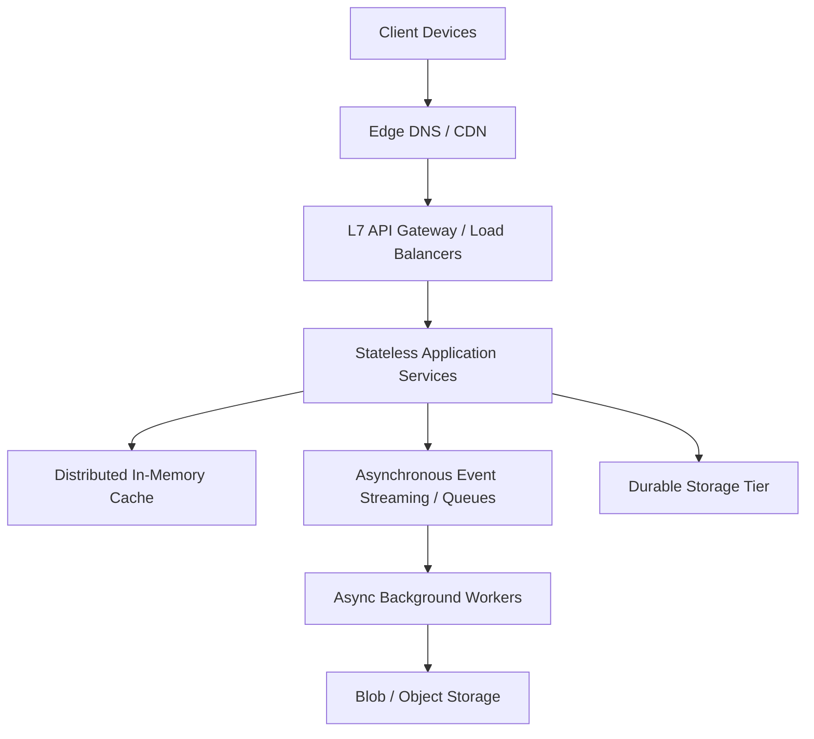

# System Architect — Enterprise Distributed Systems & Architectural Skill Engine

[](https://github.com/kallolchakraborty)
[](LICENSE)
[]()
[]()
[]()
[]()

The **System Architect** framework is an enterprise-grade distributed systems design engine engineered for Large Language Models (LLMs), Principal Software Architects, and Autonomous AI Coding Agents. It provides a standardized, mathematically rigorous methodology for designing scalable, fault-tolerant, high-throughput software architectures—from high-level cloud topologies down to low-level object-oriented design patterns, database sharding strategies, API contracts, and data pipelines.

---

## Table of Contents

- [1. Executive Overview \& System Engineering Axioms](#1-executive-overview--system-engineering-axioms)
- [2. Repository Architecture \& Directory Taxonomy](#2-repository-architecture--directory-taxonomy)
- [3. The 4-Step Production System Design Methodology](#3-the-4-step-production-system-design-methodology)
  - [Step 1: Requirements Formulation \& SLA Boundaries](#step-1-requirements-formulation--sla-boundaries)
  - [Step 2: Capacity Estimation \& Mathematical Modeling](#step-2-capacity-estimation--mathematical-modeling)
  - [Step 3: High-Level Topology Design](#step-3-high-level-topology-design)
  - [Step 4: Core Component Deep Dives \& Trade-Off Matrix](#step-4-core-component-deep-dives--trade-off-matrix)
- [4. Knowledge Base Reference Modules](#4-knowledge-base-reference-modules)
  - [Module 1: Distributed Infrastructure \& DB Scaling](#module-1-distributed-infrastructure--db-scaling)
  - [Module 2: Latency Benchmarks \& Capacity Cheat Sheet](#module-2-latency-benchmarks--capacity-cheat-sheet)
  - [Module 3: Canonical Worked System Designs](#module-3-canonical-worked-system-designs)
  - [Module 4: Low-Level Design (LLD) \& OOP Patterns](#module-4-low-level-design-lld--oop-patterns)
  - [Module 5: API Design, Protocols \& Gateway Architectures](#module-5-api-design-protocols--gateway-architectures)
  - [Module 6: Data Engineering, CDC \& Cloud-Native Compute](#module-6-data-engineering-cdc--cloud-native-compute)
- [5. Advanced Distributed Design Patterns](#5-advanced-distributed-design-patterns)
- [6. Enterprise Environment Compatibility Matrix](#6-enterprise-environment-compatibility-matrix)
- [7. Evaluation Engine \& Quality Benchmark Scorecard](#7-evaluation-engine--quality-benchmark-scorecard)
- [8. Agent Integration \& Operational Workflows](#8-agent-integration--operational-workflows)
  - [Global Agent Installation](#global-agent-installation)
  - [Project-Local Integration](#project-local-integration)
  - [Agent Prompt Blueprints](#agent-prompt-blueprints)
- [9. License \& Governance Standards](#9-license--governance-standards)

---

## 1. Executive Overview & System Engineering Axioms

Designing resilient distributed systems at scale requires disciplined trade-off analysis. The `system-architect` framework replaces generic architectural advice with structured engineering gates, mathematical capacity calculations, and verified component selection matrices.



### Core Axioms of Enterprise System Design

1. **Trade-off Primacy**: Every design decision sacrifices one system attribute to gain another. Architecture proposals must explicitly define what is gained and what is compromised.
2. **Mathematical Foundation**: Database engine selection, cache sizing, and queue topology must be preceded by quantitative calculations for Reads/sec, Writes/sec, 3-Year Storage Growth, and Network Bandwidth.
3. **Redundancy & Zero SPOF**: Every single layer—from DNS routing to primary database engines—must feature failover topology (Active-Active or Active-Passive).
4. **Resilience Engineering**: Systems must anticipate hardware failures, network partitions, and traffic surges by incorporating circuit breakers, rate limiters, retries with exponential backoff, and queue back-pressure.
5. **Compute/Storage Decoupling**: Application tiers must remain completely stateless to enable horizontal auto-scaling behind edge balancers.

---

## 2. Repository Architecture & Directory Taxonomy

```text
System Design Skill/
├── .github/
│   └── workflows/
│       └── validate.yml                 # Automated GitHub Actions CI workflow
├── scripts/
│   ├── validate_skill.py                # Structural YAML frontmatter & link validation utility
│   └── run_evals.py                     # v2.0 10-Suite Industry Evaluation Engine (300/300 Pts)
├── references/                          # Modular Knowledge Base (Progressive Disclosure)
│   ├── capacity-cheatsheet.md           # Hardware latency tables, power-of-two math, throughput formulas
│   ├── core-components.md               # DB replication, sharding, CRDTs, DNS, Service Mesh, Observability
│   ├── worked-examples.md              # 8 canonical end-to-end architectures (Twitter, Bit.ly, etc.)
│   ├── object-oriented-design.md        # LLD code implementations (LRU Cache, Parking Lot, Hash Map)
│   ├── api-design-and-protocols.md      # REST vs gRPC vs GraphQL, Idempotency, Cursor Pagination
│   └── data-engineering-and-modern-arch.md # Batch vs Stream, CDC (Debezium), Data Lakes, Serverless vs K8s
├── .gitignore                           # System and IDE exclusion rules
├── LICENSE                              # Open-source MIT License
├── README.md                            # Professional Master System Design Documentation
└── SKILL.md                             # Core LLM Agent Skill & Execution Specification
```

---

## 3. The 4-Step Production System Design Methodology

Every architecture query processed by an agent utilizing this skill strictly follows a 4-step sequence:

### Step 1: Requirements Formulation & SLA Boundaries
- **Functional Requirements**: Enumerate explicit user capabilities and system outputs. Define out-of-scope boundaries to prevent scope creep.
- **Non-Functional Requirements**: Establish quantitative targets:
  - **Read/Write Ratio**: e.g., 100:1 (Read-heavy) vs 1:1 (Write-heavy).
  - **Throughput Scale**: Daily Active Users (DAU), average RPS, and peak RPS ($2.5\times - 3\times$ average).
  - **Latency SLA**: p50 and p99 targets (e.g., "p99 read latency $< 200\text{ ms}$").
  - **Availability Target**: 99.9% (Three 9s), 99.99% (Four 9s), or 99.999% (Five 9s).
  - **Data Consistency Model**: Strong consistency vs. Eventual consistency vs. Read-your-writes.

### Step 2: Capacity Estimation & Mathematical Modeling
Execute back-of-the-envelope estimations before drafting component topologies:

$$\text{Writes/sec} = \frac{\text{Monthly Writes}}{2,500,000}$$

$$\text{Reads/sec} = \frac{\text{Monthly Reads}}{2,500,000}$$

$$\text{Peak RPS} = \text{Average RPS} \times 3$$

$$\text{Storage/Month} = \text{Record Size (Bytes)} \times \text{Monthly Writes}$$

$$\text{3-Year Storage Total} = \text{Storage/Month} \times 36$$

$$\text{Cache RAM (Pareto 80/20)} = 0.20 \times \text{Daily Active Dataset Size}$$

### Step 3: High-Level Topology Design
Construct a structured component diagram traversing client-to-storage layers:
1. **Edge Infrastructure**: Geo-DNS / Anycast Routing $\rightarrow$ Content Delivery Network (CDN).
2. **API Gateway & Ingress**: L4/L7 Load Balancers $\rightarrow$ API Gateway (Authentication, Rate Limiting, SSL Termination).
3. **Service Layer**: Stateless Microservices or Modular Monolith.
4. **Caching Layer**: In-Memory Distributed Cache (Redis / Memcached).
5. **Storage Layer**: Relational Primary-Replica / Sharded SQL or NoSQL (Document, Wide-Column, Key-Value).
6. **Async Event Pipeline**: Distributed Event Streaming (Kafka) / Task Queue (RabbitMQ) $\rightarrow$ Worker Nodes $\rightarrow$ Object Storage (S3).

### Step 4: Core Component Deep Dives & Trade-Off Matrix
Perform deep technical analysis on the top 2–3 critical components:
- **Database Engine Selection**: Justify SQL vs. NoSQL choices via CAP theorem positioning and query patterns.
- **Caching Invalidation**: Detail cache update strategies (Cache-aside, Write-through, Write-behind) and TTL policies.
- **Queue Back-Pressure**: Specify queue bounds, consumer worker pool sizing, and producer throttling.
- **Trade-off Summary Matrix**: Contrast chosen architectures against rejected alternatives.

---

## 4. Knowledge Base Reference Modules

The skill delegates technical specialization to 6 modular reference documents:

| Reference Module | Core Technical Subject | Key Contents |
|---|---|---|
| [`references/core-components.md`](file:///Users/kallolchakraborty/System%20Design%20Skill/references/core-components.md) | Infrastructure & Database Scaling | Replication topologies, database sharding, consistent hashing rings, CRDTs, service mesh, Prometheus/Jaeger observability. |
| [`references/capacity-cheatsheet.md`](file:///Users/kallolchakraborty/System%20Design%20Skill/references/capacity-cheatsheet.md) | Capacity Estimation & Latency | Hardware latency numbers (L1 cache to cross-continent RTT), power-of-two conversions, storage math reference. |
| [`references/worked-examples.md`](file:///Users/kallolchakraborty/System%20Design%20Skill/references/worked-examples.md) | Worked Architectural Designs | 8 end-to-end designs: Bit.ly, Twitter Timeline, Rate Limiter, Notification Engine, Web Crawler, Ride-Sharing, Video Streaming. |
| [`references/object-oriented-design.md`](file:///Users/kallolchakraborty/System%20Design%20Skill/references/object-oriented-design.md) | Low-Level Design (LLD) & OOP | SOLID principles, runnable Python implementations for Thread-Safe LRU Cache, Parking Lot System, HashMap with chaining. |
| [`references/api-design-and-protocols.md`](file:///Users/kallolchakraborty/System%20Design%20Skill/references/api-design-and-protocols.md) | API Contracts & Gateway Design | REST standards, Cursor vs. Offset pagination, Idempotency key implementation, gRPC/GraphQL/WebSocket comparisons, BFF pattern. |
| [`references/data-engineering-and-modern-arch.md`](file:///Users/kallolchakraborty/System%20Design%20Skill/references/data-engineering-and-modern-arch.md) | Data Engineering & Cloud Compute | Stream vs. Batch, Lambda/Kappa architecture, Data Lakehouse, Change Data Capture (Debezium), Serverless vs. Kubernetes vs. VMs. |

---

## 5. Advanced Distributed Design Patterns

### 1. Fan-out on Write (Push) vs. Fan-out on Read (Pull)
- **Push Architecture**: Pre-computes timelines on write. Fast reads ($O(1)$), but write heavy for high-follower accounts.
- **Pull Architecture**: Fetches and merges timelines on read. Fast writes, but expensive read aggregation.
- **Hybrid Architecture**: Push model for standard accounts ($<10,000$ followers); Pull model for celebrity accounts ($>1,000,000$ followers).

### 2. Command Query Responsibility Segregation (CQRS)
Separates read and write operations into independent data models. Writes execute against a normalized transactional database; reads execute against denormalized views (e.g., Elasticsearch or Redis) populated asynchronously via event streams.

### 3. Circuit Breaker Pattern
Monitors downstream service calls. When failure rates cross a pre-configured threshold, the breaker trips to an **Open** state, immediately failing subsequent requests without overwhelming the target service. Transitions to **Half-Open** after a timeout to probe service recovery.

### 4. Saga Pattern (Distributed Transactions)
Replaces blocking Two-Phase Commit (2PC) protocols across microservices. Executes a sequence of local transactions where each step publishes an event triggering the next. If a step fails, compensation transactions are executed in reverse order.

---

## 6. Enterprise Environment Compatibility Matrix

The framework is tested and compatible with major AI agent platforms and LLM orchestrators:

| Environment / Platform | Compatibility Status | Skill Loading Strategy |
|---|---|---|
| **Anthropic Claude** | ✅ Fully Supported | System Prompt / Custom Tool Skill Index |
| **Google Antigravity SDK** | ✅ Fully Supported | Auto-discovered via `~/.gemini/config/skills` |
| **Hermes Agent Framework** | ✅ Fully Supported | Auto-discovered via `~/.hermes/skills` |
| **OpenCode / OpenAI Codex** | ✅ Fully Supported | Project-Local `.agents/skills` |
| **VS Code / Cursor / Windsurf** | ✅ Fully Supported | Workspace Root Integration |

---

## 7. Evaluation Engine & Quality Benchmark Scorecard

The repository includes a v2.0 Industry-Grade Evaluation Harness (`scripts/run_evals.py`) modeling standards from Anthropic, Stanford HELM, RAGAS, LangChain, and ISO/IEC 25010.

```bash
# Execute full 10-suite evaluation harness
python3 scripts/run_evals.py
```

### Official Evaluation Scorecard

| Suite | Category | Benchmark Standard | Tested Metric | Score | Status |
|---|---|---|---|---|---|
| **Suite 1** | Frontmatter & Prompt Signal | Anthropic Skill Spec | Frontmatter schema, description $\le 1024$ chars, trigger front-loaded | 27 / 27 pts | ✅ PASS |
| **Suite 2** | Trigger Recall & Precision | HELM (Stanford) | F1 Score = 1.000 (100% Recall, 100% Precision across test prompts) | 35 / 35 pts | ✅ PASS |
| **Suite 3** | Structural Completeness | LangChain Agent Eval | Sequential 4 steps, completion criteria, HLD flow, anti-patterns | 48 / 48 pts | ✅ PASS |
| **Suite 4** | Content Coverage Matrix | RAGAS Framework | 15/15 technical domains covered (100% domain coverage) | 50 / 50 pts | ✅ PASS |
| **Suite 5** | Instruction Quality & Anti-Vagueness | ISO/IEC 25010 | Low vague density, 21 prohibitive directives, verifiable criteria | 31 / 31 pts | ✅ PASS |
| **Suite 6** | Reference & Link Integrity | Anthropic Skill Spec | 100% reference links resolve, well-formed external URLs | 19 / 19 pts | ✅ PASS |
| **Suite 7** | Code AST & Safety Verification | OWASP & Python AST | 5 Python blocks syntax valid, zero dangerous/destructive patterns | 25 / 25 pts | ✅ PASS |
| **Suite 8** | Redundancy & Duplication | RAGAS Faithfulness | Zero duplicate headers, zero duplicate paragraphs, no latency overlap | 18 / 18 pts | ✅ PASS |
| **Suite 9** | Readability & Cognitive Load | Flesch-Kincaid / UX | FK Grade 11.4, section lines $\le 100$, scannable bullet points | 16 / 16 pts | ✅ PASS |
| **Suite 10** | Token & Context Budget | Anthropic Budget Spec | SKILL.md 19.8k chars, total KB 62.2 KB, 15.1% info density | 31 / 31 pts | ✅ PASS |
| **TOTAL** | **Overall Evaluation Score** | **Industry Production Standard** | **All 60 test assertions passed** | **300 / 300 pts (100.0%)** | **🏆 PASS** |

---

## 8. Agent Integration & Operational Workflows

### Global Agent Installation

To install the skill globally across all agent workflows on your host environment:

```bash
# Gemini / Antigravity Agent Environments
mkdir -p ~/.gemini/config/skills
ln -s "/path/to/System Design Skill" ~/.gemini/config/skills/system-architect

# Hermes Agent Environments
mkdir -p ~/.hermes/skills/software-development
ln -s "/path/to/System Design Skill" ~/.hermes/skills/software-development/system-architect
```

### Project-Local Integration

To embed the skill engine directly into a specific Git project repository:

```bash
mkdir -p .agents/skills/system-architect
cp -r "/path/to/System Design Skill/"* .agents/skills/system-architect/
```

### Agent Prompt Blueprints

#### Blueprint 1: High-Scale Distributed System Architecture
```text
Act as a Principal System Architect. Design a real-time Collaborative Document Editing Platform (like Google Docs) supporting 10M DAU and 100k concurrent active documents. Follow the 4-Step System Design process. Execute full capacity math, define WebSocket sync, operational transformation / CRDTs, storage layers, and provide a full trade-off matrix.
```

#### Blueprint 2: Architecture Refactoring & Bottleneck Audit
```text
Review our current architecture: Single PostgreSQL primary database with 3 replicas, Node.js monolith, and Redis cache. We are experiencing query latency spikes during flash sales (50k writes/sec). Perform a bottleneck analysis and design a migration path to a sharded / event-driven architecture using the Strangler Fig pattern.
```

---

## 9. License & Governance Standards

This project is licensed under the terms of the **MIT License**. See [LICENSE](LICENSE) for details.

### Contribution Governance

1. **Format Compliance**: All reference documents added to `references/` must strictly adhere to the technical depth and formatting standards of the repository.
2. **Quality Gate Requirement**: Any modifications to `SKILL.md` or reference files must achieve a **100% score (300/300 pts)** on `python3 scripts/run_evals.py`.
3. **Budget Guardrails**: SKILL.md frontmatter `description` must remain $\le 1024$ characters, with trigger phrases front-loaded in the first 57 characters.
